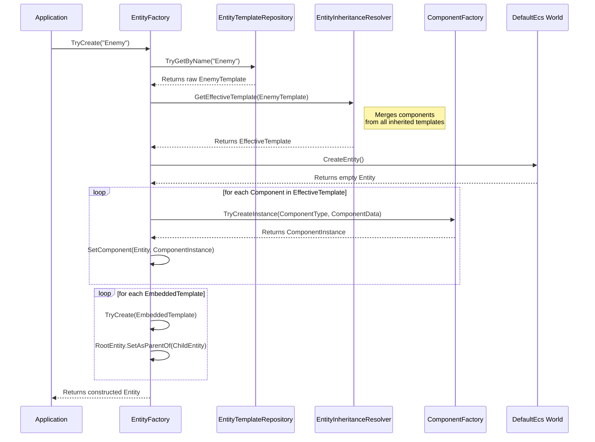
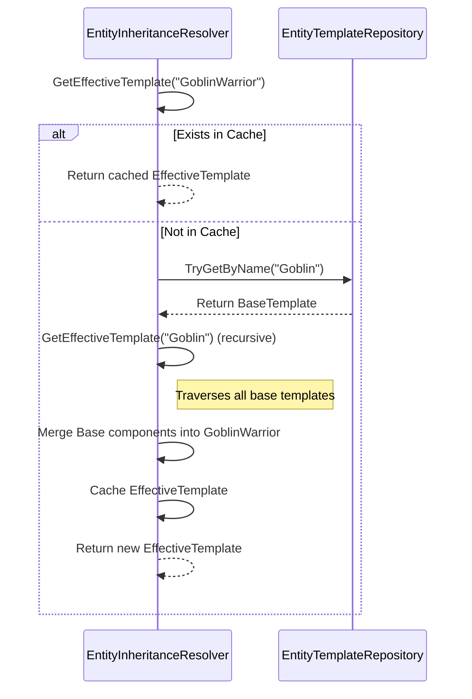

# Architecture and Design

## Introduction

`RoguelikeToolkit.Entities` provides an advanced Entity Component System (ECS) factory implementation built on top of [DefaultEcs](https://github.com/Doraku/DefaultEcs). It allows you to construct entities using JSON or YAML templates with support for inheritance and hierarchies.

## Entity Creation Flow

The following sequence diagram illustrates the flow when a user requests an entity to be created via `EntityFactory`:

## Template Inheritance Flow

When templates inherit from one another, `EntityInheritanceResolver` uses a caching mechanism to build a flattened effective template.

